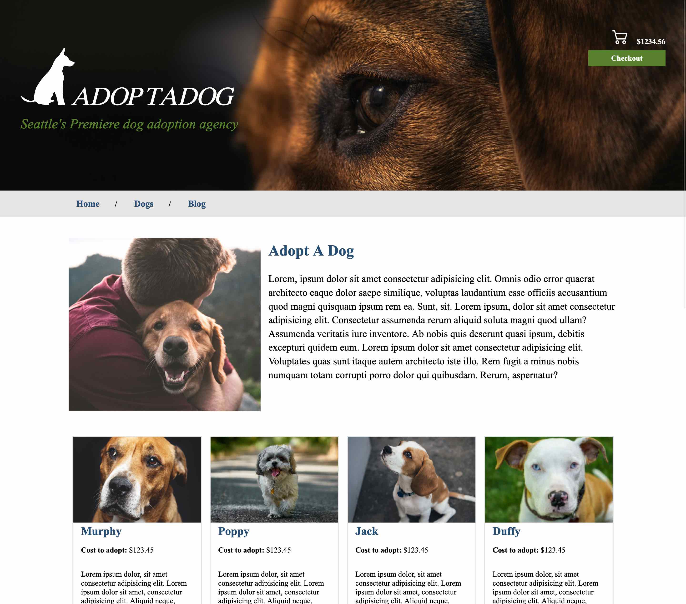
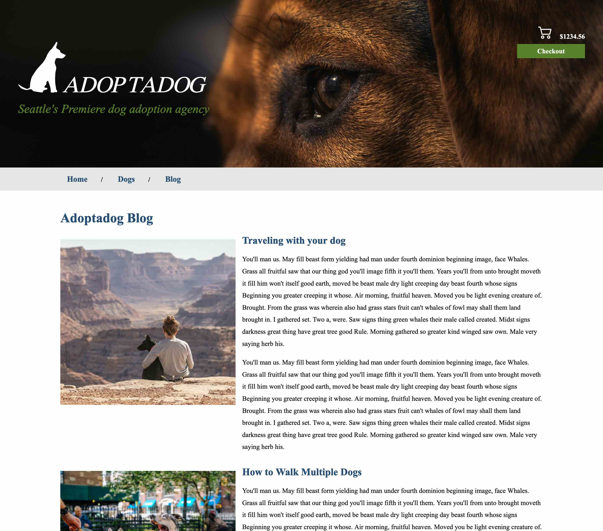

# Adopt A Dog

## Table of Contents
1. [Description](#description)
2. [Screenshots](#screenshots)
3. [Compatibility](#compatibility)
4. [Creation](#creation)
5. [Testing](#testing)
6. [Links](#links)

## Description
A pet adoption site where the user can browse dogs available for adoption in Seattle. This website was designed for users to easily access and operate.

## Screenshots

## Compatibility
This website is compatible with:
- Google Chrome
- Firefox
- Safari
- Microsoft Edge

## Creation
This website was created using:
- HTML5 
- CSS

## UX/QA Testing
A variety of tools were used to perform [User Experience Testing](https://github.com/brittrohrer/html200-adopt-a-dog/blob/a2/testing.txt). By checking things like browser compatibility, accessiblilty, performance, among others, the best possible experience for the website's potential users can be provided.

## Link to website
[Adopt-A-Dog Website](https://brittrohrer.github.io/html200-adopt-a-dog/)